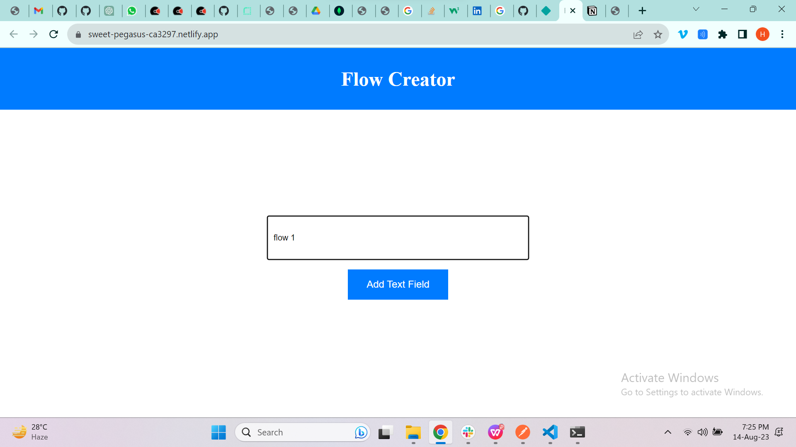
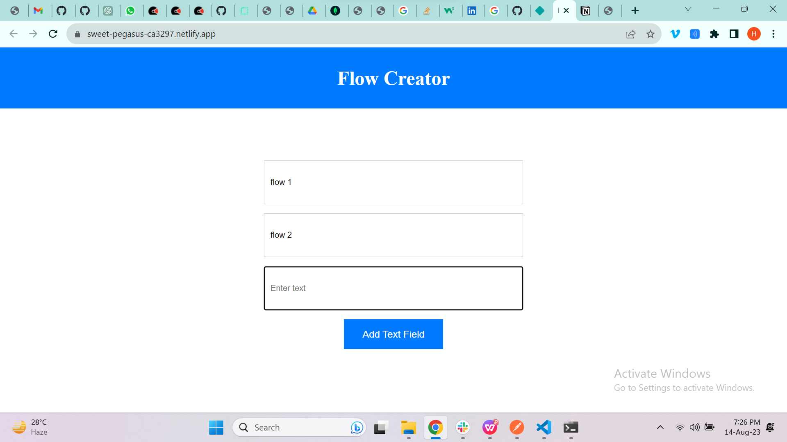

# Flow Generator

## Introduction
Flow Builder is an innovative and user-friendly platform that empowers you to create personalized task workflows with ease. Seamlessly tailor your own step-by-step processes, allowing you to effortlessly manage tasks, projects, and goals.

## Deplolyed App
https://sweet-pegasus-ca3297.netlify.app/

## Video Walkthrough of the project
https://drive.google.com/drive/folders/1KWdYEAnWCpxmq8xuKHdwkq4zYmQqxvKN?usp=drive_link

## Features
List out the key features of your application.

- Can add flow.
- Can add multiple flows
- Can drag and change positions of flow.


## Installation & Getting started
```bash
npm install
npm run server
```

## Usage



## API Endpoints
POST / - create a new flow


## Technology Stack
- Node.js
- Express.js
- MongoDB
- Sortable